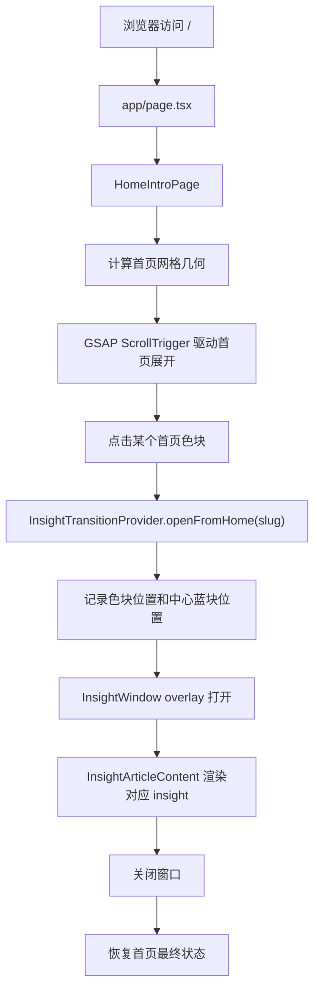

# DIG 项目结构与技术栈说明

> 本文档用于快速理解当前仓库的整体结构、运行方式、技术栈组成，以及各目录在项目中的具体职责。  
> 梳理日期：2026-06-19

## 1. 项目一句话定位

`DIG` 是一个面向“上海摩拜单车数据挖掘结果展示”的前端 monorepo。

它不是在浏览器中重新完成数据清洗、聚类、EDA 或 OD 分析，而是把已经由 Python 分析脚本产出的结论、图表、指标和叙事素材，整理成一个具有交互、动效和可视化表达的展示平台。

当前项目可以分为两层：

| 层级 | 目录 | 核心职责 |
| --- | --- | --- |
| 前端展示层 | `apps/main-platform`、`packages/*` | 用 Next.js + React + TypeScript 展示数据挖掘成果，负责页面、交互、动画、可视化和工程化 |
| 数据分析资产层 | `数据挖掘-期末` | 存放原始 CSV、Python 分析脚本、清洗后数据、聚类/EDA/OD 输出、图表和报告材料 |

## 2. 仓库总体结构

```text
dig/
├─ apps/
│  └─ main-platform/              # 主前端应用，Next.js App Router 项目
│     ├─ app/
│     │  ├─ page.tsx              # 首页入口，渲染 HomeIntroPage
│     │  ├─ layout.tsx            # 全局布局、metadata、转场 Provider
│     │  ├─ globals.css           # 全站样式、首页样式、详情页样式
│     │  ├─ beams-background.tsx   # Three.js 光束背景组件
│     │  ├─ home/                 # 首页滚动网格与色块入口
│     │  ├─ insights/             # 8 个详情展示页、转场窗口、地图数据
│     │  └─ fonts/                # 本地 DingTalk JinBuTi 字体资源
│     ├─ next.config.mjs
│     ├─ package.json
│     ├─ postcss.config.mjs
│     └─ tsconfig.json
│
├─ packages/
│  ├─ config-eslint/              # 共享 ESLint Flat Config
│  ├─ typescript-config/          # 共享 TypeScript 配置
│  ├─ ui-components/              # 可复用视觉组件、窗口组件、WebGL 背景
│  └─ utils/                      # 纯工具函数：数学、随机数等
│
├─ 数据挖掘-期末/
│  ├─ mobike_shanghai_sample_updated.csv
│  ├─ main/data-mining/           # Python 数据分析脚本与结果
│  ├─ plan-docs/                  # 课程项目计划、过程文档
│  ├─ 项目报告.md
│  └─ 前端设计大纲.md
│
├─ package.json                   # 根脚本入口，交给 Turbo 编排
├─ pnpm-workspace.yaml            # workspace 范围
├─ turbo.json                     # monorepo 任务编排
├─ eslint.config.mjs              # 仓库级 ESLint 入口
├─ README.md
└─ 项目安装与运行指南.md
```

## 3. Monorepo 工程组织

本仓库采用 `pnpm workspace + Turborepo`。

### 3.1 pnpm workspace

`pnpm-workspace.yaml` 指定了两个 workspace 范围：

```yaml
packages:
  - "apps/*"
  - "packages/*"
```

含义：

- `apps/*` 放可以独立运行或部署的应用。
- `packages/*` 放共享能力，例如配置、UI 组件、工具函数。
- 根目录不直接承载业务页面，主要负责依赖锁定、任务入口和 monorepo 管理。

根 `package.json` 固定：

| 项 | 当前值 | 作用 |
| --- | --- | --- |
| `packageManager` | `pnpm@11.5.0` | 固定包管理器版本，保证安装行为一致 |
| `engines.node` | `>=20.19.0` | 约束 Node.js 版本 |
| `turbo` | `2.9.16` | 编排多个 workspace 的脚本 |

### 3.2 Turborepo

`turbo.json` 定义了四类任务：

| 任务 | 作用 | 特点 |
| --- | --- | --- |
| `dev` | 启动开发环境 | `cache: false`，`persistent: true`，适合长期运行 |
| `build` | 构建应用/包 | 依赖上游包的 `build`，缓存 `.next/**`、`dist/**` |
| `lint` | 代码规范检查 | 依赖上游包的 `lint` |
| `type-check` | TypeScript 类型检查 | 依赖上游包的 `type-check` |

根目录脚本只是统一入口：

```bash
corepack pnpm dev
corepack pnpm build
corepack pnpm lint
corepack pnpm type-check
```

真正的主应用开发命令在 `apps/main-platform/package.json` 中：

```bash
next dev --port 3000 --webpack
next build
next start
eslint .
tsc --noEmit
```

## 4. 完整技术栈清单

### 4.1 前端与应用框架

| 技术 | 当前版本 | 在项目中的作用 |
| --- | --- | --- |
| Next.js | `16.2.6` | 主应用框架，使用 App Router，负责路由、页面渲染、构建和静态参数生成 |
| React | `19.2.6` | 组件模型、状态管理、hooks、客户端交互 |
| React DOM | `19.2.6` | 浏览器端渲染 React 组件 |
| TypeScript | `6.0.3` | 类型系统，约束页面配置、数据结构、组件 props、动画状态 |

主应用使用 Next.js App Router：

- `/` 对应 `apps/main-platform/app/page.tsx`
- `/insights/[slug]` 对应 `apps/main-platform/app/insights/[slug]/page.tsx`
- `layout.tsx` 提供全局 HTML、metadata 和 `InsightTransitionProvider`

### 4.2 动画与交互

| 技术 | 当前版本 | 在项目中的作用 |
| --- | --- | --- |
| GSAP | `^3.15.0` | 核心动画引擎，控制首页滚动网格、SVG 线条绘制、详情页打开/关闭、图表入场和交互反馈 |
| `@gsap/react` | `^2.1.2` | React 与 GSAP 的集成依赖；当前代码主要直接使用 `gsap.context()` 和 React hooks |
| GSAP ScrollTrigger | 随 GSAP | 首页桌面端滚动驱动动画、pin 固定视口 |
| GSAP Flip | 随 GSAP | 已注册，用于共享元素过渡类场景 |
| GSAP CustomEase | 随 GSAP | 自定义线条绘制和自行车图标绘制的缓动曲线 |

本项目里的 GSAP 不是简单装饰动画，而是页面结构的一部分：

- 首页从中心蓝色区域展开为 8 个展示色块。
- 滚动时同步计算网格线、色块位置、中心自行车 SVG 绘制。
- 点击色块后，详情窗口从首页色块位置扩展为全屏黑色窗口。
- 关闭详情页时，窗口收回并恢复首页最终状态。
- 多个图表和模块使用 GSAP 控制条形图、地图、节点、线条、清洗流程动画。

### 4.3 视觉、样式与字体

| 技术 | 当前版本 | 在项目中的作用 |
| --- | --- | --- |
| Tailwind CSS | `^4.3.0` | 通过 `@import "tailwindcss"` 接入；当前主要仍以自定义 CSS 类为主 |
| `@tailwindcss/postcss` | `^4.3.0` | Tailwind 4 的 PostCSS 插件 |
| PostCSS | `^8.5.15` | CSS 处理管线 |
| Autoprefixer | `^10.5.0` | 自动补全浏览器前缀 |
| DingTalk JinBuTi 本地字体 | 本地 `woff2` | 首页和展示页的中文标题、艺术化文字 |
| `@fontsource/michroma` | `^5.2.8` | 科技感数字/英文显示字体依赖，CSS 中使用 `--font-michroma` 变量 |
| `@fontsource/noto-sans-sc` | `^5.2.9` | 中文无衬线字体依赖 |

当前主要样式集中在：

- `apps/main-platform/app/globals.css`：主应用全局样式、首页、详情页、各 insight 模块样式。
- `packages/ui-components/src/product-window/styles.css`：共享 UI 包中 product window 相关样式。
- `apps/main-platform/app/fonts/ding-talk-jin-bu-ti/font.css`：本地字体分片声明。

### 4.4 图形、WebGL 与可视化

| 技术 | 当前版本 | 在项目中的作用 |
| --- | --- | --- |
| Three.js | `^0.183.2` | WebGL 场景、shader 光束背景、hyperspeed 道路背景 |
| postprocessing | `^6.39.1` | Three.js 后处理，用于 bloom、SMAA 等视觉效果 |
| OGL | `^1.0.11` | 已安装为图形相关依赖；当前源码未发现直接使用 |
| SVG | 浏览器原生 | 首页网格线、自行车图标、地图、图表、流向曲线、成员图标 |
| CSS variables | 浏览器原生 | 管理模块主题色、字体、布局参数 |

具体使用位置：

- `apps/main-platform/app/beams-background.tsx`：用 Three.js 自定义 shader 渲染光束背景。
- `packages/ui-components/src/product-window/HyperspeedBackground.tsx`：用 Three.js + postprocessing 实现高速道路/霓虹背景。
- `apps/main-platform/app/insights/shanghaiMapData.ts`：保存上海行政区 SVG path、地理边界和地图来源。
- `apps/main-platform/app/insights/InsightArticleContent.tsx`：大量使用 SVG 生成统计图、地图、流向图、环形图和流程动画。

### 4.5 图标

| 技术 | 当前版本 | 在项目中的作用 |
| --- | --- | --- |
| lucide-react | `^0.577.0` | 在清洗流程控制等 UI 中提供按钮图标，例如上一页、下一页、重播 |

### 4.6 代码质量与类型配置

| 技术 | 当前版本 | 在项目中的作用 |
| --- | --- | --- |
| ESLint | `10.4.1` | 统一代码检查 |
| `@next/eslint-plugin-next` | `16.2.6` | Next.js 推荐规则和 Core Web Vitals 规则 |
| `typescript-eslint` | `8.46.2` | TypeScript 解析器和规则 |
| `@types/react` | `19.2.15` | React 类型 |
| `@types/react-dom` | `19.2.3` | React DOM 类型 |
| `@types/node` | `25.9.1` | Node.js 类型 |
| `@types/three` | `^0.183.1` | Three.js 类型 |

共享配置目录：

- `packages/typescript-config/base.json`：严格模式、ES2022、bundler 模块解析、noEmit、增量编译等基础规则。
- `packages/typescript-config/nextjs.json`：Next 应用使用，包含 DOM lib、`jsx: preserve`、Next TS 插件。
- `packages/typescript-config/library.json`：共享包使用，包含 DOM lib、`jsx: react-jsx`。
- `packages/config-eslint/next.js`：主应用 ESLint 规则。
- `packages/config-eslint/library.js`：共享包 ESLint 规则。

### 4.7 数据分析侧技术栈

`数据挖掘-期末/main/data-mining` 是课程数据分析资产，不属于 Next.js 运行时，但属于项目完整交付的一部分。

| 技术 | 在项目中的作用 |
| --- | --- |
| Python | 执行数据清洗、EDA、聚类、OD 流向分析 |
| pandas | 读取 CSV、清洗数据、聚合统计、计算指标 |
| numpy | 数值处理、矩阵/数组计算 |
| matplotlib | 输出 PNG 图表 |
| scikit-learn KMeans | 空间热点聚类、区域划分、OD 区域标签 |
| scikit-learn StandardScaler | 聚类前特征标准化 |
| pathlib | 跨平台文件路径处理 |

主要脚本：

| 文件 | 作用 |
| --- | --- |
| `data_cleaning.py` | 读取原始 CSV，解析时间，提取时间特征，计算骑行时长，过滤异常，输出 `cleaned_mobike.csv` |
| `eda_analysis.py` | 对清洗后数据做基础统计、时间规律、骑行时长分布，并输出图表 |
| `clustering.py` | 使用 KMeans 做空间热点聚类，并输出聚类图表和分析文本 |
| `od_analysis.py` | 基于 KMeans 区域标签构造 OD 矩阵，分析区域间流向 |

主要结果：

- `cleaned_mobike.csv`
- `mobike_with_clusters.csv`
- `outputs/数据清洗.txt`
- `outputs/eda分析.txt`
- `outputs/聚类分析.txt`
- `outputs/od分析.txt`
- `charts/eda_charts/*.png`
- `charts/clustering_charts/*.png`
- `charts/od_charts/*.png`

## 5. 主应用 `apps/main-platform` 结构

### 5.1 App Router 入口

| 文件 | 职责 |
| --- | --- |
| `app/page.tsx` | 首页入口，只负责渲染 `HomeIntroPage` |
| `app/layout.tsx` | 设置中文页面、metadata，引入全局 CSS 和字体，并包裹 `InsightTransitionProvider` |
| `app/globals.css` | 全站视觉样式的主体文件 |

`layout.tsx` 中的 `InsightTransitionProvider` 很关键，它让首页和详情页可以共享转场状态。

### 5.2 首页模块 `app/home`

首页由一个滚动驱动的可视化网格组成。

| 文件 | 职责 |
| --- | --- |
| `HomeIntroPage.tsx` | 首页主组件：管理视口尺寸、GSAP 时间线、滚动动画、色块点击、键盘打开 |
| `utils.ts` | 计算网格几何、色块位置、轨道插值、自行车 SVG path、样式同步 |
| `shared/coords.ts` | 首页基础尺寸、断点、色彩、网格比例、面板色值 |
| `shared/animation.ts` | 注册 GSAP 插件，定义自定义缓动曲线 |

首页核心机制：

1. 根据视口尺寸计算初始网格和最终网格。
2. 桌面端先显示中心蓝块和引导线。
3. 滚动时通过 ScrollTrigger 把初始布局插值到最终 8 色块布局。
4. 色块点击后调用 `openFromHome(slug)`，进入详情窗口转场。
5. 移动端不做复杂滚动重排，直接展示最终状态。

首页面板与详情页 slug 的关系由 `INSIGHTS` 配置连接。

### 5.3 详情页模块 `app/insights`

| 文件 | 职责 |
| --- | --- |
| `config.ts` | 定义 8 个详情页 slug、对应首页面板、顺序、主题色、启用状态 |
| `[slug]/page.tsx` | Next 动态路由，生成静态参数并渲染独立详情页 |
| `InsightTransitionProvider.tsx` | 管理首页到详情页的打开/关闭状态、锁定滚动、隐藏/恢复共享元素 |
| `InsightWindow.tsx` | 全屏黑色详情窗口，负责打开/关闭动画、左侧蓝色按钮、内容承载 |
| `InsightArticleContent.tsx` | 8 个展示模块的核心内容、图表、交互和数据常量 |
| `shanghaiMapData.ts` | 上海行政区地图 SVG path、地理边界、地图来源 |

8 个展示模块：

| slug | 首页色块 | 展示内容 |
| --- | --- | --- |
| `insight-01` | 项目总览 | 总订单、有效订单、用户数、单车数、核心发现 |
| `insight-02` | 数据清洗 | 清洗流程、异常过滤规则、分步动画 |
| `insight-03` | 时间规律 | 小时订单量、工作日/周末对比、高峰时段 |
| `insight-04` | 骑行时长 | 时长直方图、均值/中位数、核心区间和长尾 |
| `insight-05` | 空间热点 | 上海地图、K=6 热点区域、聚类点和区域摘要 |
| `insight-06` | 流向分析 | OD 区域节点、Top N 流向、区域内/跨区比例 |
| `insight-07` | 成员介绍 | 成员职责、线稿图标、介绍排版 |
| `insight-08` | 结论展望 | 最终结论、局限、未来方向、环形图 |

### 5.4 详情页转场状态机

`InsightTransitionProvider` 中维护了一个简单但关键的窗口阶段：

```text
closed -> opening -> open -> closing -> closed
```

职责包括：

- 记录当前打开的 `activeSlug`。
- 保存首页色块和中心蓝块的位置快照。
- 在详情页打开时锁定首页滚动并禁用 ScrollTrigger。
- 隐藏首页共享元素，避免首页元素和详情页动画副本同时可见。
- 关闭详情页时恢复首页最终状态。
- 使用 `requestAnimationFrame` 和版本号避免过期回调污染当前转场。

这部分是项目里最需要谨慎维护的逻辑之一。

## 6. 共享包 `packages/*`

### 6.1 `packages/typescript-config`

提供统一 TS 配置：

| 文件 | 用途 |
| --- | --- |
| `base.json` | 所有 TS 项目的基础配置 |
| `nextjs.json` | Next.js 应用配置 |
| `library.json` | React/TS 共享库配置 |

当前主应用：

```json
{
  "extends": "@dig/typescript-config/nextjs.json"
}
```

共享包：

```json
{
  "extends": "@dig/typescript-config/library.json"
}
```

### 6.2 `packages/config-eslint`

提供统一 ESLint Flat Config。

| 文件 | 用途 |
| --- | --- |
| `next.js` | 约束 `apps/main-platform/**/*`，包含 Next 推荐规则 |
| `library.js` | 约束 `packages/*/src/**/*`，适合共享库 |

根目录 `eslint.config.mjs` 聚合两个配置，并忽略构建输出、依赖目录、声明文件等。

### 6.3 `packages/ui-components`

这是可复用 UI 和视觉组件包。

导出入口：

```ts
export * from "./product-window";
```

`product-window` 当前包含：

| 文件 | 作用 |
| --- | --- |
| `HyperspeedBackground.tsx` | Three.js + postprocessing 的高速道路/霓虹背景 |
| `hyperspeedPresets.ts` | Hyperspeed 背景参数预设 |
| `panels/PanelBlueMain.tsx` | 蓝色主面板，组合 Hyperspeed 背景和线框动画 |
| `panels/PanelBlueLines.tsx` | SVG 线框绘制动画 |
| `coords.ts` | product window 的固定设计坐标 |
| `animation.ts` | product window 的 GSAP 自定义缓动 |
| `styles.css` | product window 样式 |

注意：`apps/main-platform` 的 `package.json` 已依赖 `@dig/ui-components`，`next.config.mjs` 也配置了 `transpilePackages: ["@dig/ui-components"]`。但从当前源码搜索看，主应用页面暂时没有直接从 `@dig/ui-components` 导入组件，首页和详情页更多是在 `apps/main-platform/app` 内直接实现。

### 6.4 `packages/utils`

提供纯工具函数：

| 文件 | 导出 | 作用 |
| --- | --- | --- |
| `math.ts` | `lerp`、`clamp`、`nsin`、`mapRange` | 插值、范围限制、数值映射 |
| `random.ts` | `random`、`pickRandom` | 随机取值、随机选项 |
| `index.ts` | 聚合导出 | 统一入口 |

当前主应用依赖了 `@dig/utils`，但源码中暂未发现直接导入。未来可以把 `home/utils.ts` 或 WebGL 背景中的通用数学逻辑逐步沉淀到这个包里。

## 7. 数据资产目录 `数据挖掘-期末`

这个目录是前端展示内容的来源，不是 Next.js 的运行目录。

```text
数据挖掘-期末/
├─ mobike_shanghai_sample_updated.csv       # 原始数据
├─ 项目报告.md
├─ 前端设计大纲.md
├─ 摩拜共享单车2016年8月数据集_readme.md
├─ plan-docs/
└─ main/data-mining/
   ├─ data_cleaning.py
   ├─ eda_analysis.py
   ├─ clustering.py
   ├─ od_analysis.py
   ├─ cleaned_mobike.csv
   ├─ mobike_with_clusters.csv
   ├─ outputs/
   └─ charts/
```

前端目前并没有在运行时读取这些 Python 输出文件，而是把核心指标、文本、地图 path 和图表结构内联整理在 TypeScript 文件里，尤其是 `InsightArticleContent.tsx`。

这种方式适合课程展示：

- 不需要后端。
- 不依赖运行 Python。
- 可以静态部署。
- 所有交互都在浏览器端完成。

但后续如果数据经常变化，可以考虑把这些内联常量拆成 `JSON` 或 `TS data` 文件，降低 `InsightArticleContent.tsx` 的体积。

## 8. 当前页面运行链路



独立详情页也可以通过 `/insights/insight-01` 到 `/insights/insight-08` 访问。此时 `InsightWindow` 使用 `standalone` 模式，不依赖首页色块快照。

## 9. 关键配置文件说明

| 文件 | 作用 |
| --- | --- |
| `package.json` | 根脚本入口、Node 版本、pnpm 版本、Turbo 依赖 |
| `pnpm-workspace.yaml` | 声明 monorepo workspace 范围 |
| `turbo.json` | 定义 dev/build/lint/type-check 的任务依赖和缓存 |
| `eslint.config.mjs` | 仓库级 ESLint 配置入口 |
| `apps/main-platform/package.json` | 主应用依赖和脚本 |
| `apps/main-platform/next.config.mjs` | Next 配置，转译 `@dig/ui-components` |
| `apps/main-platform/tsconfig.json` | 主应用 TS 配置，继承共享 Next 配置 |
| `apps/main-platform/postcss.config.mjs` | Tailwind CSS 4 和 autoprefixer 接入 |

## 10. 常用开发命令

根目录执行：

```bash
corepack pnpm install
corepack pnpm dev
corepack pnpm build
corepack pnpm lint
corepack pnpm type-check
```

只运行主应用：

```bash
corepack pnpm --filter main-platform dev
corepack pnpm --filter main-platform build
corepack pnpm --filter main-platform type-check
```

只检查共享包：

```bash
corepack pnpm --filter @dig/ui-components type-check
corepack pnpm --filter @dig/utils type-check
```

## 11. 当前结构的优点

- 前端工程和数据分析资产分层明确。
- monorepo 已具备共享配置、共享 UI、共享工具函数的扩展基础。
- 主应用可静态化展示，不需要后端服务。
- GSAP 动画状态机已经形成“首页色块 -> 详情窗口 -> 回到首页”的完整体验。
- TypeScript 类型约束覆盖了路由 slug、面板 key、数据结构、图表数据和转场状态。
- 数据分析脚本、输出图表、报告材料都保留在仓库中，便于追溯展示内容来源。

## 12. 当前需要注意的维护点

1. `InsightArticleContent.tsx` 文件非常大，集中承载了 8 个模块的常量、组件和交互逻辑。后续维护时建议按模块拆分，例如：

```text
insights/articles/OverviewArticle.tsx
insights/articles/CleanLabArticle.tsx
insights/articles/TimePatternArticle.tsx
insights/data/time.ts
insights/data/duration.ts
```

2. `@dig/ui-components` 和 `@dig/utils` 已经配置为 workspace 依赖，但主应用当前未明显消费。后续可以逐步把稳定的视觉组件和纯函数沉淀进去。

3. 首页和详情页转场强依赖 GSAP、DOM 快照、ScrollTrigger 禁用/恢复、隐藏共享元素。修改这部分时要重点验证：

- 快速连续点击不同色块。
- 打开后立刻关闭。
- 等动画结束后再打开/关闭。
- 独立访问 `/insights/[slug]`。
- 桌面端和移动端布局。

4. `globals.css` 体积较大，承载了所有模块样式。后续如果模块继续增加，建议按模块拆成 CSS 文件或 CSS Modules，再由页面按需引入。

5. 数据分析目录里的 Python 脚本输出和前端内联数据之间目前不是自动同步关系。如果重新跑分析脚本，需要手动确认前端常量是否同步更新。

## 13. 推荐理解顺序

如果第一次接手这个项目，建议按这个顺序阅读：

1. `README.md`：先理解项目目标和八个展示区规划。
2. `package.json`、`pnpm-workspace.yaml`、`turbo.json`：理解 monorepo 怎么运行。
3. `apps/main-platform/app/page.tsx` 和 `layout.tsx`：理解入口。
4. `apps/main-platform/app/home/HomeIntroPage.tsx`：理解首页和色块入口。
5. `apps/main-platform/app/insights/InsightTransitionProvider.tsx`：理解首页到详情页的状态机。
6. `apps/main-platform/app/insights/InsightWindow.tsx`：理解详情窗口动画。
7. `apps/main-platform/app/insights/InsightArticleContent.tsx`：理解 8 个展示模块。
8. `数据挖掘-期末/main/data-mining`：追溯数据来源和分析逻辑。
9. `packages/*`：理解共享配置和后续可复用能力。

## 14. 简短总结

本项目的核心技术栈可以概括为：

```text
pnpm workspace + Turborepo
Next.js 16 + React 19 + TypeScript 6
GSAP + ScrollTrigger + CustomEase + SVG
Tailwind CSS 4 + 大量自定义 CSS
Three.js + postprocessing
Python + pandas + numpy + matplotlib + scikit-learn
```

其中，前端展示的主干是 `Next.js + React + TypeScript`，视觉动效的主干是 `GSAP + SVG + Three.js`，数据来源的主干是 `Python 数据分析脚本与其输出结果`。
